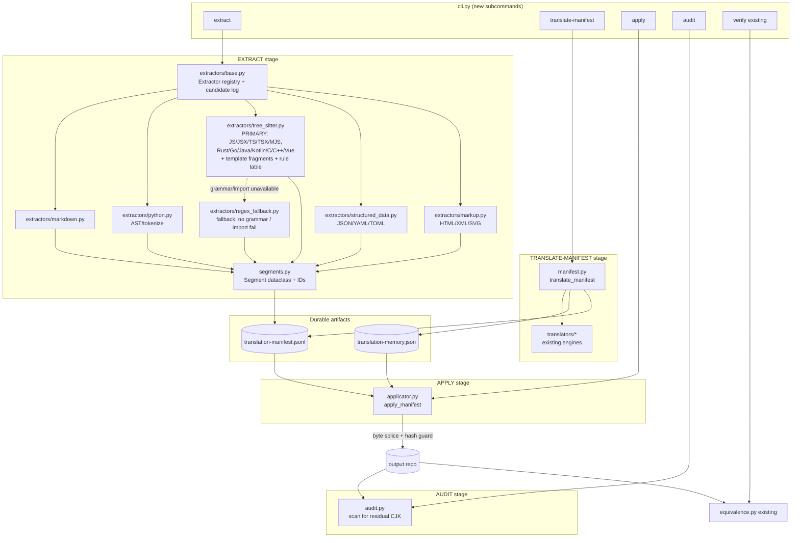
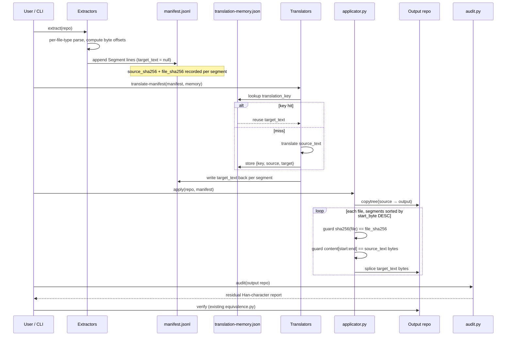

# Design Document: Translation Manifest Pipeline

## Overview

`repo-translator` today runs a single-pass, in-memory pipeline: clone → detect CJK files →
extract translatable spans → swap them for `__REPO_TRANSLATOR_SPAN_########__` markers → batch
translate → reassemble → write. The marker map (`markers_by_text`) exists only for the lifetime of
one file translation and is discarded. There is no durable record of *what* was translated, *where*
it lived in the source, or *why* a given string got a given translation. That makes runs
non-reproducible, non-auditable, and impossible to resume at segment granularity or to hand-review
before applying.

This feature adds a **durable, byte-offset-precise manifest layer** as an *additive* mode alongside
the existing fast in-memory pipeline. The work is split into five explicit stages — **EXTRACT →
TRANSLATE-MANIFEST → APPLY → AUDIT → VERIFY** — connected by two on-disk artifacts:
`translation-manifest.jsonl` (one segment per line) and `translation-memory.json` (context-aware
source→target reuse). Each segment carries exact `start_byte`/`end_byte` offsets and a `file_sha256`
guard so that APPLY can splice translations back with byte precision and refuse to touch any file
that changed since EXTRACT.

The two most important correctness properties, and the pieces most missing today, are (1) the **hash
guard** that prevents applying stale translations to a mutated file, and (2) **byte-offset splicing
in descending order** so that editing a later span never invalidates the offsets of an earlier one.
Everything else (protected-token handling, structured-file validation, atomic writes, CJK detection,
equivalence verification) is reused from the existing modules rather than rewritten.

### Why AST / Tree-sitter extraction (not per-line regex)

The current in-memory pipeline extracts strings with `QUOTED_STRING_PATTERN` in `core.py`. That
pattern has a **confirmed bug**: its backtick alternative uses the character class
`` [^`\\$] ``, which excludes `$`. A template literal containing `${...}` therefore fails to match
the pattern *entirely*, so CJK text inside interpolated template literals is silently skipped. For
example:

```js
console.warn(`[decor] 装饰包 ${pack} manifest 校验失败:`)
```

The Chinese text (`装饰包`, `校验失败`) never gets extracted, even though downstream code assumes
`${...}` interpolations were already extracted and protected. This inconsistency — the regex both
*fails to match the string at all* and *is presumed to have protected the interpolation* — is
concrete evidence that per-line regex extraction is structurally insufficient for code. A regex
cannot see that `${pack}` is an embedded expression that must stay verbatim while the surrounding
text fragments are translatable.

This motivates making **Tree-sitter the PRIMARY extractor for grammar-backed code files**. A
concrete syntax tree distinguishes a `template_string` from its `template_substitution` children and
hands back exact byte ranges, so the two Chinese fragments above become two precise segments while
`${pack}` is left untouched. Regex is retained only for narrow, well-behaved roles (Han-ideograph
detection and a no-grammar fallback), not for structural extraction.

---

## Architecture

### Component diagram



### Data flow across the five stages



### Design principles

- **Additive, not a rewrite.** The manifest pipeline is a new set of stages/CLI commands. The
  existing `translate` command and its in-memory path stay byte-for-byte unchanged. `RepoTranslator`
  gains opt-in hooks (`--export-manifest` / `--apply-manifest`) but its default behavior is
  untouched.
- **Reuse over reinvention.** `PROTECTED_TOKEN_PATTERN`, `_has_cjk_ideograph`, `detector.has_cjk`,
  `RepoTranslator._write_text_atomic`, `_validate_translated_content`, `get_translatable_files`, and
  `equivalence.verify_equivalence` are all reused directly.
- **Bytes are the source of truth.** Offsets, hashes, and splicing all operate on UTF-8 *bytes*, not
  Python `str` indices, because multi-byte CJK makes character offsets and byte offsets diverge and
  because file hashes are defined over bytes.
- **Fail loud on drift.** A file that changed after EXTRACT, or a segment whose recorded
  `source_text` no longer matches the bytes at its offset, is a hard error (configurable), never a
  silent best-effort merge.

---

## Data Models

### Segment (one JSONL line in `translation-manifest.jsonl`)

```python
# segments.py
from __future__ import annotations
from dataclasses import dataclass, asdict, field
from typing import Optional
import json

@dataclass
class Segment:
    """One translatable span located precisely in one source file.

    Two identical source strings at different positions produce two Segments
    (distinct id / offsets) but may share one translation via translation_key.
    """
    id: str                       # stable per (path, start_byte, end_byte); see make_segment_id
    path: str                     # repo-relative POSIX path
    kind: str                     # SegmentKind value (comment, docstring, jsx_text, ...)
    start_byte: int               # inclusive UTF-8 byte offset of source_text within the file
    end_byte: int                 # exclusive UTF-8 byte offset (content[start:end] == source_text)
    line: int                     # 1-based line of start_byte (human orientation only)
    column: int                   # 0-based column of start_byte (human orientation only)
    source_text: str              # exact original span text (decoded UTF-8)
    target_text: Optional[str]    # None until translated; the translated span text
    file_sha256: str              # sha256 of the whole source file bytes at extract time
    source_sha256: str            # sha256 of source_text bytes (integrity of this span)
    translation_key: str          # context-aware reuse key; see make_translation_key
    context_before: str = ""      # up to N chars before start_byte, for disambiguation/QA
    context_after: str = ""       # up to N chars after end_byte
    protected_context: list[str] = field(default_factory=list)
    # Interpolation expressions adjacent to / within this span that were left
    # verbatim, e.g. ["${pack}"]. INFORMATIONAL ONLY: shown to a human reviewer
    # so they can see what was preserved. NOT spliced back at APPLY time.

    def to_json_line(self) -> str:
        return json.dumps(asdict(self), ensure_ascii=False)

    @classmethod
    def from_json_line(cls, line: str) -> "Segment":
        return cls(**json.loads(line))

    @property
    def is_translated(self) -> bool:
        return self.target_text is not None
```

**Validation rules**

- `end_byte > start_byte >= 0`.
- `sha256(source_text.encode("utf-8")) == source_sha256`.
- `path` is repo-relative, POSIX-separated, never absolute, never escaping the repo (`..`).
- `kind` is a member of `SegmentKind`.
- Within one `path`, no two segments' `[start_byte, end_byte)` ranges overlap.
- `protected_context` (when present) lists interpolation expressions preserved verbatim; it round-trips
  through the manifest via `asdict`/`from_json_line` unchanged and is never used by APPLY — a segment's
  spliced bytes are exactly `target_text`, so the recorded `${...}` snippets stay outside the span.

```python
# segments.py
class SegmentKind:
    COMMENT = "comment"
    DOCSTRING = "docstring"
    STRING = "string"                 # user-facing string literal
    TEMPLATE_STRING = "template_string"
    TEMPLATE_STRING_FRAGMENT = "template_string_fragment"  # one string_fragment inside a template literal
    JSX_TEXT = "jsx_text"
    UI_ATTRIBUTE = "ui_attribute"     # title / placeholder / aria-label / alt
    JSON_VALUE = "json_value"
    YAML_VALUE = "yaml_value"
    TOML_VALUE = "toml_value"
    MARKDOWN_HEADING = "markdown_heading"
    MARKDOWN_PARAGRAPH = "markdown_paragraph"
    MARKDOWN_TABLE_CELL = "markdown_table_cell"
    MARKDOWN_LINK_LABEL = "markdown_link_label"
    HTML_TEXT = "html_text"
    LINE_COMMENT = "line_comment"
    BLOCK_COMMENT = "block_comment"
    DOC_COMMENT = "doc_comment"
```

### ManifestHeader (first line of the JSONL, `type == "header"`)

```python
@dataclass
class ManifestHeader:
    type: str = "header"
    version: int = 1
    source_lang: str = "zh"
    target_lang: str = "en"
    repo_root: str = ""            # absolute path at extract time (informational)
    created_at: str = ""           # ISO-8601
    segment_count: int = 0         # filled/validated on finalize
```

The manifest file is line-delimited JSON: line 1 is the header object, every subsequent line is one
`Segment`. JSONL is chosen over a single JSON array so a repo with tens of thousands of segments can
be streamed and appended without loading the whole file into memory.

### TranslationMemory (`translation-memory.json`)

```python
# manifest.py
@dataclass
class MemoryEntry:
    translation_key: str
    source_text: str
    target_text: str
    kind: str                      # which SegmentKind produced this key
    hits: int = 0                  # how many segments reused it (telemetry)

@dataclass
class TranslationMemory:
    """source→target reuse keyed by context-aware translation_key.

    Distinct from occurrence mapping: many Segments may point to one MemoryEntry.
    Upgrades the current markers_by_text dedup (which keys purely on source text)
    by folding kind + optional context into the key, so 状态/任务/处理 can resolve
    differently in UI vs DB vs docs.
    """
    entries: dict[str, MemoryEntry]  # translation_key -> MemoryEntry
```

**Validation rules**

- `translation_key` is the map key and equals `entry.translation_key`.
- `target_text` is non-null for a stored entry (only translated results are memoized).
- The memory file is optional input; a missing file is treated as empty.

---

## Translation memory key derivation

The current dedup keys purely on source text (`markers_by_text[text]`). That conflates a UI label,
a DB column comment, and a doc heading that happen to share the same Chinese string but need
different English. The new key folds in `kind` and, optionally, a small context window:

```python
# segments.py
import hashlib

def make_translation_key(
    source_text: str,
    kind: str,
    *,
    context: str = "",
) -> str:
    """Context-aware reuse key.

    Base key = sha256(source_text + "\x1f" + kind). When context-awareness is
    enabled for a kind (e.g. short UI strings), context is appended so the same
    word can resolve differently across UI/DB/docs. \x1f (unit separator) is used
    as a delimiter that cannot appear in normal source text.
    """
    parts = [source_text, kind]
    if context:
        parts.append(context)
    digest = hashlib.sha256("\x1f".join(parts).encode("utf-8")).hexdigest()
    return digest


def make_segment_id(path: str, start_byte: int, end_byte: int) -> str:
    """Stable, position-based occurrence id (NOT a reuse key)."""
    raw = f"{path}\x1f{start_byte}\x1f{end_byte}"
    return hashlib.sha256(raw.encode("utf-8")).hexdigest()[:16]
```

Whether `context` participates is decided per `kind` via a policy set (e.g. UI attributes and short
strings are context-sensitive; long markdown paragraphs are not, since collisions are unlikely and
context churn would defeat reuse). This keeps common prose highly reusable while letting ambiguous
short terms diverge.

---

## Components and Interfaces

### `segments.py`

Pure data + helpers, no I/O beyond hashing.

```python
def make_segment_id(path: str, start_byte: int, end_byte: int) -> str: ...
def make_translation_key(source_text: str, kind: str, *, context: str = "") -> str: ...

def build_segment(
    *,
    path: str,
    kind: str,
    start_byte: int,
    end_byte: int,
    file_bytes: bytes,
    source_text: str,
    context_chars: int = 40,
    context_sensitive: bool = False,
    protected_context: list[str] | None = None,
) -> Segment:
    """Assemble a fully-validated Segment from a located span.

    Computes line/column from file_bytes[:start_byte], source_sha256, file_sha256,
    context_before/after, translation_key, and id. Asserts
    file_bytes[start_byte:end_byte].decode('utf-8') == source_text. `protected_context`
    (default empty) carries interpolation snippets preserved verbatim, e.g. ["${pack}"].
    """
```

### `manifest.py`

Manifest + memory read/write and the TRANSLATE-MANIFEST orchestration.

```python
class Manifest:
    header: ManifestHeader
    path: Path

    @classmethod
    def open_for_write(cls, path: Path, header: ManifestHeader) -> "Manifest": ...
    def append(self, segment: Segment) -> None: ...          # streams one JSONL line
    def finalize(self) -> None: ...                          # rewrites header.segment_count

    @classmethod
    def read(cls, path: Path) -> tuple[ManifestHeader, list[Segment]]: ...
    @staticmethod
    def iter_segments(path: Path) -> Iterator[Segment]: ...   # streaming reader

def rewrite_targets(path: Path, updated: dict[str, str]) -> None:
    """Atomically rewrite the manifest, filling target_text for segment ids in `updated`.
    Uses the same temp-file + os.replace pattern as RepoTranslator._write_text_atomic."""

def load_memory(path: Path | None) -> TranslationMemory: ...
def save_memory(path: Path, memory: TranslationMemory) -> None: ...

def translate_manifest(
    manifest_path: Path,
    translator,                       # existing translator engine (get_translator)
    *,
    memory: TranslationMemory | None = None,
    memory_path: Path | None = None,
    batch_size: int = 40,
) -> ManifestStats:
    """TRANSLATE-MANIFEST stage.

    For every segment with target_text is None:
      1. If translation_key in memory -> reuse, increment hits.
      2. Else collect into a batch keyed by translation_key (dedup within batch),
         translate via translator (reusing RepoTranslator batch semantics /
         _translate_preserving_tokens for protected tokens), store into memory.
    Writes target_text back into the manifest (rewrite_targets) and persists memory.
    Idempotent: re-running only fills still-missing targets.
    """
```

**Responsibilities**

- Own the JSONL format (header + segment lines) and atomic rewrites.
- Deduplicate work by `translation_key` before hitting the provider.
- Preserve protected technical tokens by routing span text through the existing
  `RepoTranslator._translate_preserving_tokens` logic (shared, not duplicated).

### `extractors/base.py`

```python
@dataclass
class Candidate:
    """A located span the extractor considered, with its translatability verdict.

    Extractors emit Candidates for every span they inspect — not just the ones
    they keep — so skipped spans and *why* they were skipped are auditable rather
    than silently dropped.
    """
    segment: Segment          # fully-built Segment (offsets, hashes, protected_context)
    translatable: bool        # True -> written to manifest; False -> logged only
    reason: str               # short human-readable rationale, e.g.
                              # "console.warn arg (UI/message)" or
                              # "import module source" or "className value"


@dataclass
class ExtractionReport:
    """Audit trail for one EXTRACT run: what was skipped and which files degraded.

    Populated as extract_repo consumes Candidates. Surfaced to the user (CLI/log)
    so exclusion decisions are visible instead of silent.
    """
    skipped: list[tuple[str, int, str, str]] = field(default_factory=list)
    #   (path, start_byte, snippet, reason) for each translatable == False candidate
    fallback_files: list[str] = field(default_factory=list)
    #   files that used the lower-fidelity regex fallback (no grammar / import fail)


class Extractor(Protocol):
    def supports(self, path: Path) -> bool: ...
    def extract(self, path: Path, file_bytes: bytes) -> list[Candidate]: ...

# Registry maps suffix -> Extractor. Tree-sitter extractors are PRIMARY for
# grammar-backed code files; get_extractor falls back to the regex extractor
# (extractors/regex_fallback.py, wrapping the existing extract_translatable_text
# behavior) only when no structured extractor applies or a grammar/import is
# unavailable.
def get_extractor(path: Path) -> Extractor | None: ...
def register(extractor: Extractor, suffixes: Iterable[str]) -> None: ...

def extract_repo(
    root: Path,
    *,
    include_patterns: list[str] | None = None,
    exclude_patterns: list[str] | None = None,
    translate_code: bool = False,
    source_is_cjk: bool = True,
    report: ExtractionReport | None = None,
) -> Iterator[Segment]:
    """EXTRACT stage. Walk get_translatable_files(root, ...), pick an extractor per
    file, collect Candidates, and yield only the Segments of candidates with
    translatable == True. Only spans containing real CJK (_has_cjk_ideograph) when
    source_is_cjk, mirroring the current gate in _translate_source_line.

    Every skipped candidate (translatable == False) is recorded in `report` with
    its path, offset, snippet, and reason so the exclusion decisions are auditable
    — nothing is silently dropped. `report` also records which files used the
    lower-fidelity regex fallback (no grammar / import failed)."""
```

Each extractor's single hard contract: for every `Candidate` it returns,
`file_bytes[c.segment.start_byte:c.segment.end_byte].decode("utf-8") == c.segment.source_text`. This
is the invariant APPLY relies on for the candidates that become manifest segments.

**Extraction-time vs persisted metadata.** `translatable`/`reason` live on the `Candidate` wrapper,
not on `Segment`, because they describe an extraction decision rather than a property of the stored
span; they are surfaced in the `ExtractionReport` (log) and need not persist in the manifest.
`protected_context`, by contrast, *is* on `Segment` because a reviewer wants it alongside the
translated text. `build_segment` stays the Segment factory; extractors wrap its result in a
`Candidate` with the verdict.

### `extractors/markdown.py`

Extract headings, paragraphs, table cells, and link labels. Do **not** extract fenced code blocks,
inline code, URLs, link targets, or template placeholders — these are already carved out by
`PROTECTED_TOKEN_PATTERN` and the fence/table logic in `_translate_markdown`, which is reused to
find span boundaries. Byte offsets are computed by locating each translatable run within the raw
bytes rather than reflowing text.

### `extractors/python.py`

Reuse the existing AST/`tokenize` approach. `_find_python_docstrings` already locates docstrings via
AST; extend with `tokenize.generate_tokens` to capture `COMMENT` tokens and (optionally, under
`--translate-code`) user-facing string literals. Each token carries `(start_row, start_col)` /
`(end_row, end_col)`; convert to byte offsets via a precomputed line-start byte table. Never emit
segments for identifiers, import paths, regexes, or machine-readable constants.

### `extractors/tree_sitter.py` (PRIMARY code extractor)

This is the **primary** extractor for grammar-backed source languages — `.js .jsx .ts .tsx .mjs`,
`.rs`, `.go`, `.java .kt`, `.c .cpp .h`, and `.vue`. It parses the file to a concrete syntax tree
and reads node byte ranges directly (`node.start_byte` / `node.end_byte` are already byte offsets,
exactly what the manifest wants), fully replacing the per-line regex approach for these files.
Python is deliberately **not** routed here — it stays on the solid existing AST/`tokenize`
extractor (`extractors/python.py`).

Regex is demoted to two narrow roles only, both retained:
1. **Han-ideograph detection** on a node's text — reuse the existing `CJK_IDEOGRAPH_PATTERN` /
   `_has_cjk_ideograph` to decide whether a node is a translation candidate at all.
2. **Fallback extraction** (`extractors/regex_fallback.py`) for files with no available grammar or
   when a grammar/import fails — see the dependency posture below.

#### Template-literal fragment splitting

A JS/TS `template_string` node is *not* emitted as a single translatable unit. The extractor walks
its children and emits **one `TEMPLATE_STRING_FRAGMENT` segment per `string_fragment` child that
contains a Han ideograph**, using that fragment's exact byte range. It **never** emits
`template_substitution` (`${...}`) nodes as translatable — those are the embedded expressions that
must stay verbatim. Each emitted fragment records the adjacent/enclosed substitutions in
`protected_context` (informational) so a reviewer sees what was preserved.

**Worked example** — the string that the old `QUOTED_STRING_PATTERN` silently skipped:

```js
console.warn(`[decor] 装饰包 ${pack} manifest 校验失败:`)
```

Tree-sitter parses this to a `template_string` with children:
`string_fragment("[decor] 装饰包 ")`, `template_substitution("${pack}")`,
`string_fragment(" manifest 校验失败:")`. Both fragments contain Han ideographs, so the extractor
emits **two** segments:

| kind | source_text | protected_context |
|------|-------------|-------------------|
| `template_string_fragment` | `"[decor] 装饰包 "` | `["${pack}"]` |
| `template_string_fragment` | `" manifest 校验失败:"` | `["${pack}"]` |

`${pack}` is left untouched between them. This is exactly the two-segment manifest the interpolation
case requires, and it fixes the template-literal bug at its root: the CST sees the fragments the
regex could not.

#### Context-aware translatability rule table (TS/TSX/JS)

Whether a `string` / `template_string_fragment` / `jsx_text` / `comment` node is translatable is
decided by its **syntactic context** — the extractor consults each node's parent/ancestors. The
extractor encodes this as a documented rule set and attaches the matching `reason` to every
`Candidate`:

| Node / context | Translatable? | reason |
|----------------|---------------|--------|
| `comment` (line/block/doc) | ✅ yes | "comment" |
| `jsx_text` node | ✅ yes | "jsx text" |
| string/fragment arg to `console.*(...)` | ✅ yes | "console.* arg (message)" |
| string/fragment arg to `throw new Error(...)` / error constructors | ✅ yes | "error message" |
| UI attribute value: `placeholder`, `title`, `aria-label`, `alt` | ✅ yes | "UI attribute" |
| import specifier / module source string (`import ... from "x"`, `require("x")`) | ❌ no | "import/module source" |
| string arg to `fetch(...)` and route/router calls | ❌ no | "route/endpoint" |
| `className` attribute value | ❌ no | "className" |
| `data-testid` / other test-selector attributes | ❌ no | "test selector" |
| object property **key** | ❌ no | "object key" |
| machine-readable constant (enum-ish / SCREAMING_SNAKE / no CJK) | ❌ no | "machine constant" |

Rust/Go/Java/etc. reuse the same shape: comments and doc comments are translatable; UI/log/error
string literals are translatable; import/module paths, keys, route strings, and test selectors are
not. Every inspected node becomes a `Candidate`; only `translatable == true` ones reach the
manifest, and the rest are logged to the `ExtractionReport` with their `reason`.

#### Dependency posture (changed: now default, not an extra)

`tree-sitter` + `tree-sitter-language-pack` ship prebuilt wheels, so they are now a **default
runtime dependency** — code extraction works out of the box and the template-literal bug is fixed
for a fresh install. The tradeoff is explicit: the base install gains these two dependencies in
exchange for correct, structural code extraction. The regex fallback
(`extractors/regex_fallback.py`) is kept purely as a safety net for when a specific grammar or the
import is unavailable at runtime; files that hit the fallback are flagged in the `ExtractionReport`
as lower-fidelity so users know which files used the degraded path.

```python
# ponytail: import still guarded so a missing/broken grammar degrades to the
# regex fallback instead of crashing extraction — but tree-sitter is a default
# dep now, so the guarded path is the exception, not the norm.
```

### `extractors/structured_data.py`

JSON/YAML/TOML: parse the tree and translate values only, never keys, and never endpoint-like
values (URLs, paths, enum-ish tokens). JSON offsets: reuse `json` with a positional scan, or locate
each string value's bytes by re-finding it near its parse position. YAML: `ruamel`/`pyyaml`
round-trip is lossy for offsets, so values are located by byte search within the original bytes and
validated against the parsed value. Reuse `RepoTranslator._validate_translated_content` semantics at
APPLY time to guarantee the spliced file still parses.

### `extractors/markup.py`

HTML/XML/SVG: translate text nodes and UI attributes (`title`, `alt`, `aria-label`, `placeholder`)
only. **Explicitly skip SVG internal identifiers** — `id` attributes and `#`-references
(`<path id="路径">`, `<g id="页面-1">`, `xlink:href="#..."`, `url(#...)`) — because translating them
breaks CSS selectors and internal references. Uses `xml.etree.ElementTree` (already used by
`equivalence.py`) to walk nodes; byte offsets located by matching node text within the raw bytes.

### `applicator.py`

```python
def apply_manifest(
    manifest_path: Path,
    source_root: Path,
    output_root: Path,
    *,
    memory: TranslationMemory | None = None,
    fail_on_source_mismatch: bool = True,
) -> ApplyStats:
    """APPLY stage. Copy source_root -> output_root (shutil.copytree, symlinks=True),
    then splice translations into each file using byte offsets.

    Guards, per file:
      - sha256(current_file_bytes) must equal the file_sha256 recorded on its
        segments; otherwise the file changed since extract -> skip + record
        mismatch (or raise if fail_on_source_mismatch).
    Guards, per segment:
      - file_bytes[start:end] must equal source_text bytes; otherwise raise.
    Segments within a file are applied in DESCENDING start_byte order so that
    splicing a later span never shifts the offsets of an earlier one.
    Writes via the atomic temp-file + os.replace pattern and validates structured
    files (_validate_translated_content) before commit.
    """
```

### `audit.py`

```python
def audit_repo(root: Path, *, include_patterns=None, exclude_patterns=None) -> AuditReport:
    """AUDIT stage. Walk get_translatable_files and flag any file still containing
    Han ideographs (reuse detector.has_cjk / _has_cjk_ideograph). Reports path,
    line, and the residual snippet so a human can see what slipped through."""
```

Reuses `equivalence.verify_equivalence` unchanged for the VERIFY stage (build/test + structural
invariants); no new code needed there.

---

## Key Functions with Formal Specifications

### `apply_manifest` (the critical path)

**Preconditions**
- `manifest_path` exists and its header/segments pass validation.
- `source_root` exists and is a readable directory.
- `output_root` does not alias `source_root`.

**Postconditions**
- For every file whose segments all passed the hash guard, `output_root/<path>` equals the source
  file with each segment's `source_text` bytes replaced by `target_text` bytes (when present).
- Structured files (`.json/.yaml/.yml/.toml/.py`) in the output still parse.
- No file is partially applied: either all its segments splice successfully, or the file is written
  unchanged (copied) and a mismatch is recorded.

**Loop invariant (per-file splice loop)**
- Segments are processed in strictly descending `start_byte`. Because each splice only mutates bytes
  at `[start_byte, end_byte)` and all remaining segments have strictly smaller `start_byte`, every
  not-yet-applied segment's offsets remain valid against the working buffer.

### `build_segment`

**Preconditions**
- `0 <= start_byte < end_byte <= len(file_bytes)`.
- `file_bytes[start_byte:end_byte]` is valid UTF-8.

**Postconditions**
- Returns a `Segment` where `file_bytes[start:end].decode("utf-8") == source_text`,
  `source_sha256 == sha256(source_text bytes)`, and `line/column` correspond to `start_byte`.

### `translate_manifest`

**Preconditions**
- `manifest_path` is a valid manifest; `translator` exposes `translate_text` (and optionally
  `translate_batch`).

**Postconditions**
- Every segment that had `target_text is None` and whose `translation_key` resolved (via memory or
  provider) now has a non-null `target_text`.
- `memory` contains an entry for every newly translated `translation_key`.
- Idempotent: a second run performs no provider calls if all targets are filled.

---

## Apply algorithm (Python)

```python
import hashlib, shutil
from pathlib import Path
from collections import defaultdict

def sha256_bytes(data: bytes) -> str:
    return hashlib.sha256(data).hexdigest()

def apply_manifest(manifest_path, source_root, output_root, *,
                   fail_on_source_mismatch=True):
    header, segments = Manifest.read(manifest_path)

    if Path(output_root).resolve() == Path(source_root).resolve():
        raise ValueError("output_root must differ from source_root")
    shutil.copytree(source_root, output_root, symlinks=True, dirs_exist_ok=True)

    by_path: dict[str, list[Segment]] = defaultdict(list)
    for seg in segments:
        by_path[seg.path].append(seg)

    stats = ApplyStats()
    for rel_path, segs in by_path.items():
        target_file = Path(output_root) / rel_path
        file_bytes = target_file.read_bytes()
        current_hash = sha256_bytes(file_bytes)

        # Hash guard: every segment recorded the same file_sha256 at extract time.
        expected = segs[0].file_sha256
        if current_hash != expected:
            stats.record_mismatch(rel_path)
            if fail_on_source_mismatch:
                raise ValueError(
                    f"{rel_path} changed since extract "
                    f"(have {current_hash[:12]}, manifest {expected[:12]})"
                )
            continue  # leave the copied-through file untouched

        buffer = bytearray(file_bytes)
        # DESCENDING start_byte keeps earlier offsets valid after each splice.
        for seg in sorted(segs, key=lambda s: s.start_byte, reverse=True):
            if seg.target_text is None:
                continue
            actual = bytes(buffer[seg.start_byte:seg.end_byte])
            if actual.decode("utf-8", "replace") != seg.source_text:
                raise ValueError(
                    f"{rel_path}@{seg.start_byte}: source_text drift; "
                    f"refusing to splice"
                )
            buffer[seg.start_byte:seg.end_byte] = seg.target_text.encode("utf-8")

        new_text = buffer.decode("utf-8")
        _validate_translated_content(target_file, new_text)   # reused from core.py
        _write_text_atomic(target_file, new_text)             # reused from core.py
        stats.record_applied(rel_path, len(segs))

    return stats
```

Note the whole-file hash guard is checked once per file (all a file's segments share one
`file_sha256`), and the per-segment `source_text` check is a second, finer guard against manifest
corruption or offset bugs.

## How extractors compute byte offsets

- **Read once as bytes.** Extractors receive `file_bytes = path.read_bytes()` and decode as needed.
  Offsets and hashes are always byte-based.
- **Tree-sitter** hands back `node.start_byte` / `node.end_byte` directly — no conversion.
- **Python `tokenize`/`ast`** give `(row, col)` in *characters*. A one-time line-start byte table
  (`byte_offset_of_line[n]`) plus `len(line[:col].encode("utf-8"))` converts `(row, col)` → byte
  offset. The helper lives in `segments.py` and is shared.
- **Markdown / structured / markup** locate each translatable run by scanning the raw bytes for the
  known substring near its structural position, then assert the round-trip
  (`file_bytes[start:end].decode() == source_text`) before emitting.

---

## Example Usage

```python
# EXTRACT
from repo_translator.manifest import Manifest, ManifestHeader
from repo_translator.extractors.base import extract_repo

header = ManifestHeader(source_lang="zh", target_lang="en", repo_root=str(root))
man = Manifest.open_for_write(root / "translation-manifest.jsonl", header)
for seg in extract_repo(root, translate_code=False):
    man.append(seg)
man.finalize()

# TRANSLATE-MANIFEST
from repo_translator.manifest import translate_manifest, load_memory, save_memory
from repo_translator.translators import get_translator

memory = load_memory(root / "translation-memory.json")
tr = get_translator(engine="google", source_lang="zh", target_lang="en")
translate_manifest(root / "translation-manifest.jsonl", tr,
                   memory=memory, memory_path=root / "translation-memory.json")

# APPLY (hash-guarded, byte-precise)
from repo_translator.applicator import apply_manifest
apply_manifest(root / "translation-manifest.jsonl", source_root=root,
               output_root=out, fail_on_source_mismatch=True)

# AUDIT
from repo_translator.audit import audit_repo
report = audit_repo(out)
print(report.summary())
```

### CLI usage

```bash
# staged pipeline
repo-translator extract -r ./retain-pdf -o manifest/                     # writes translation-manifest.jsonl
repo-translator translate-manifest -m manifest/translation-manifest.jsonl \
    --translator google --translation-memory manifest/translation-memory.json
repo-translator apply -m manifest/translation-manifest.jsonl \
    -r ./retain-pdf -o ./retain-pdf-en --fail-on-source-mismatch
repo-translator audit -d ./retain-pdf-en
repo-translator verify -s ./retain-pdf -t ./retain-pdf-en

# or keep the existing fast path and just emit/consume a manifest as a side artifact
repo-translator translate -r ./retain-pdf -o ./retain-pdf-en --export-manifest manifest.jsonl
repo-translator translate -r ./retain-pdf -o ./retain-pdf-en --apply-manifest manifest.jsonl
```

---

## CLI command signatures and flags

New `click` subcommands in `cli.py` (mirroring existing option conventions):

```python
@main.command()  # EXTRACT
@click.option("--repo", "-r", required=True)
@click.option("--output-dir", "-o", default=".", help="Where to write manifest artifacts")
@click.option("--source-lang", "-s", default="zh")
@click.option("--target-lang", "-t", default="en")
@click.option("--translate-code/--docs-only", default=False)
@click.option("--include", "include_patterns", multiple=True)
@click.option("--exclude", "exclude_patterns", multiple=True)
def extract(...): ...

@main.command(name="translate-manifest")
@click.option("--manifest", "-m", required=True)
@click.option("--translator", default="google")
@click.option("--api-key", envvar="TRANSLATOR_API_KEY", default=None)
@click.option("--translation-memory", default=None, help="Path to translation-memory.json")
@click.option("--batch-size", default=40, type=click.IntRange(1, 100))
def translate_manifest_cmd(...): ...

@main.command()  # APPLY
@click.option("--manifest", "-m", required=True)
@click.option("--repo", "-r", required=True, help="Source repo (offsets are relative to it)")
@click.option("--output-dir", "-o", required=True)
@click.option("--fail-on-source-mismatch/--skip-on-source-mismatch", default=True)
def apply(...): ...

@main.command()  # AUDIT
@click.option("--dir", "-d", required=True)
@click.option("--include", "include_patterns", multiple=True)
@click.option("--exclude", "exclude_patterns", multiple=True)
def audit(...): ...
```

Existing `verify` command is unchanged and serves as the VERIFY stage.

### New flags on the existing `translate` command

- `--export-manifest PATH` — run the normal in-memory translation, but also emit a manifest as a
  by-product (for record/audit).
- `--apply-manifest PATH` — skip live translation; splice targets from an existing manifest via
  `apply_manifest`.
- `--translation-memory PATH` — supply/persist the reuse store across runs.
- `--fail-on-source-mismatch / --skip-on-source-mismatch` — APPLY hash-guard behavior.
- `--audit-untranslated` — after writing output, run `audit_repo` and surface residual CJK.

---

## Integration with the existing RepoTranslator

- `RepoTranslator.__init__` gains optional fields (`export_manifest_path`, `apply_manifest_path`,
  `translation_memory_path`, `fail_on_source_mismatch`, `audit_untranslated`), all defaulting to the
  current behavior (no manifest).
- `RepoTranslator.run` branches once, up front:
  - **apply mode** (`apply_manifest_path` set): call `applicator.apply_manifest` instead of
    `self.translate`, then continue into the existing review/verify/push steps unchanged.
  - **export mode** (`export_manifest_path` set): run `self.translate` as today, and additionally
    invoke `extract_repo` to persist a manifest artifact.
  - **default**: unchanged in-memory path.
- Shared helpers stay on `RepoTranslator` and are imported by the new modules rather than copied:
  `_translate_preserving_tokens`, `_translate_many`, `_replace_translation_markers`,
  `_write_text_atomic`, `_validate_translated_content`. `manifest.translate_manifest` reuses the
  first three for provider batching + protected-token safety; `applicator.apply_manifest` reuses the
  last two for safe writes.

### Safe translation ordering (retain-pdf target)

Extraction is ordered/filterable so a human can translate and apply in low-risk waves:
docs/markdown first → comments/docstrings → UI strings (TS/TSX/HTML) → error/log messages (after
review). Identifiers, routes, keys, import paths, CSS classes, and SVG IDs are never extracted, so
they can never be translated regardless of stage. `--include`/`--exclude` and `kind` filtering drive
the wave selection.

---

## Error Handling

### File changed since EXTRACT (hash-guard failure)
**Condition:** `sha256(current file bytes) != segment.file_sha256`.
**Response:** raise `ValueError` (when `fail_on_source_mismatch`) or skip the file and record a
mismatch in `ApplyStats`.
**Recovery:** user re-runs EXTRACT for the changed file, then TRANSLATE/APPLY again.

### Source-text drift at a segment offset
**Condition:** `file_bytes[start:end] != source_text` even though the file hash matched.
**Response:** hard `ValueError` — indicates a manifest/offset bug or corruption; never splice.
**Recovery:** regenerate the manifest.

### Translated structured file no longer parses
**Condition:** spliced `.json/.yaml/.toml/.py` fails `_validate_translated_content`.
**Response:** reject the file (raise before the atomic replace); the copied-through original stays.
**Recovery:** fix or drop the offending segment's `target_text` and re-apply.

### Tree-sitter grammar / import unavailable
**Condition:** although `tree-sitter` + `tree-sitter-language-pack` are default dependencies, a
specific grammar is missing or the import fails at runtime.
**Response:** fall back to `extractors/regex_fallback.py`; flag the file in the `ExtractionReport` as
lower-fidelity so the degraded coverage is visible. Note the fallback inherits the historical
template-literal limitation, so interpolated CJK in those files may be missed — the report makes
that explicit.
**Recovery:** repair the environment (reinstall `tree-sitter-language-pack`) and re-run EXTRACT for
the affected files.

### Provider returns wrong count / transient failure
**Condition:** batch length mismatch or network error.
**Response:** reuse existing `_translate_many` semantics (one retry, then hard error on count
mismatch).

---

## Testing Strategy

### Unit tests
- `segments.build_segment`: round-trip invariant `file_bytes[start:end].decode() == source_text`
  across ASCII and multi-byte CJK; line/column correctness.
- `make_translation_key`: same source + different `kind`/`context` → different keys; identical
  inputs → identical key.
- Each extractor: known fixture → expected segments with correct byte offsets; negative cases
  (code fences, import paths, SVG ids, JSON keys, URLs, `className`, `data-testid`, `fetch`/route
  strings) produce candidates with `translatable == False` and a `reason` (surfaced in the
  `ExtractionReport`), **not** manifest segments.
- Tree-sitter template-literal splitting: the worked example
  `` console.warn(`[decor] 装饰包 ${pack} manifest 校验失败:`) `` yields exactly two
  `template_string_fragment` segments (`"[decor] 装饰包 "` and `" manifest 校验失败:"`), each with
  `protected_context == ["${pack}"]`, and `${pack}` is never emitted as a segment. This is the
  regression test for the historical `QUOTED_STRING_PATTERN` bug.
- `apply_manifest`: descending-order splice correctness with multiple CJK segments per line; hash
  guard raises on a mutated file; source-text drift raises; structured-file validation rejects
  broken output.

### Property-based testing
**Library:** `hypothesis` (added under the `dev` extra).

Round-trip property (the core correctness guarantee): for a generated file with CJK spans, EXTRACT
then APPLY with an identity "translation" (`target_text == source_text`) must reproduce the original
file byte-for-byte. With a length-changing translation, applying in descending order must equal a
reference splice computed independently. Also: applying twice (idempotency after hash re-record)
must not corrupt the file.

### Integration tests
- Full five-stage run on a small synthetic repo (md + py + json + a tsx file) → assert no residual
  CJK in translatable positions, structured files still parse, and `verify_equivalence` reports no
  errors.
- Fallback path: force Tree-sitter unavailable → pipeline still completes via regex extractor.

---

## Dependencies

- **Reused (already present):** `click`, `rich`, `pyyaml`, `gitpython`, `langdetect`,
  `deep-translator`, `requests`, `xml.etree.ElementTree`, `hashlib`, `json`, `tokenize`/`ast`,
  `tomllib` (3.11+, with the existing graceful skip on 3.9/3.10).
- **New, default runtime:** `tree-sitter` + `tree-sitter-language-pack`. These ship prebuilt wheels,
  so making them default keeps install friction low while giving correct structural extraction for
  `.js/.jsx/.ts/.tsx/.mjs`, `.rs`, `.go`, `.java/.kt`, `.c/.cpp/.h`, and `.vue` out of the box — and
  fixing the template-literal extraction bug for a fresh install. **Tradeoff:** the base install
  gains two dependencies; in exchange, code extraction is correct by default rather than relying on
  the flawed per-line regex. The import remains guarded so a missing/broken grammar degrades to the
  regex fallback instead of crashing.
- **New, dev only:** `hypothesis` for property-based round-trip tests.

The only new *required* runtime dependency is Tree-sitter (moved from an optional extra to default);
everything else in the manifest layer is built from the standard library plus what the project
already ships.
